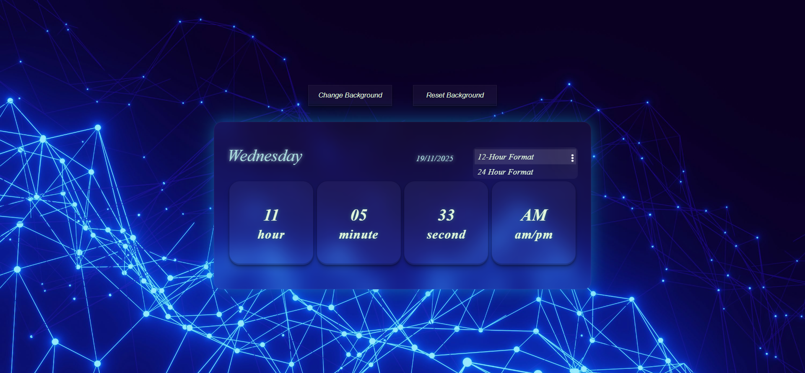

# Digital Clock
A simple and stylish Digital Clock built using HTML, CSS, and JavaScript.
This project displays the current time, day, and date, and includes several interactive features such as background changer and format switching.

## Features

**Real-Time Clock**

- Displays hours, minutes, seconds

- Auto-updates every second

**12-Hour & 24-Hour Format Toggle**

- Dropdown menu with two options

- Instantly switches format using clean JavaScript logic

**Complete Date Display**

- Date shown in DD/MM/YYYY format

- Day name also displayed (Mon–Sun)

**Custom Background Changer**

- Upload any image from your device

- Automatically applied to the full screen

- Includes Reset to Default option

**Clean & Modern UI**
- Simple Layout

- Smooth spacing

- Easy to read fonts

**Local Storage Support**
- Background stay saved even after refreshing the page

## Tech Stack

- HTML5
- CSS3
- JAVASCRIPT

## Screenshots

### Background Image


### Clock Screenshot


## Structure
```
Digital Clock

 ├─ src
 │  ├─ bgImages.jpg
 │  └─ icon.png
 ├─ index.html
 ├─ clock.css
 ├─ clock.js
 └─ README.md

```
## Installation & Setup

1. **Clone the repository**
```
git clone https://github.com/sneha-20-singh/DigitalClock.git
```

2. **Open the project**
```
cd DigitalClock
```

3. **Run the project**

 - Simply open index.html in any web browser 
  <br>
  OR
 - Run with a live server extension(VS Code recommended)

 ## How It Works

**Time Logic**

- Uses new Date() to get current hour, minute, second

- Updates using setInterval() every 1000ms

- Applies 12H or 24H logic based on user selection

- AM/PM displayed automatically when in 12H mode

**Date Logic**

- Uses getDate(), getMonth(), getFullYear()

- padStart() used for adding leading zeros

- Day name fetched using array mapping

**Background Changer**

- File input → reads image → sets body.style.backgroundImage

- Reset button → removes the custom image

**UI Interaction**

- Menu toggles on click

- Format switching updates UI instantly

- Clicking on the hour minute or second block triggers a 360-degree flip animation.

## License

- This project is open-source and free to use.
- Feel free to modify,improve, or contribute!

## Contributing
- Feel free to open issues or submit pull requests!

---

<div align="center">
 Support This Project ❤️  


If you found this To-Do App interesting, please consider giving it a ⭐ <br>
Made with ❤️ by Sneha Singh

</div>


